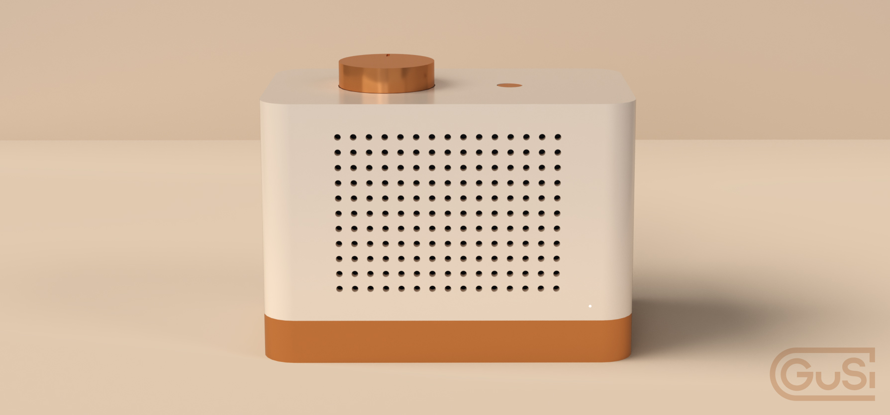
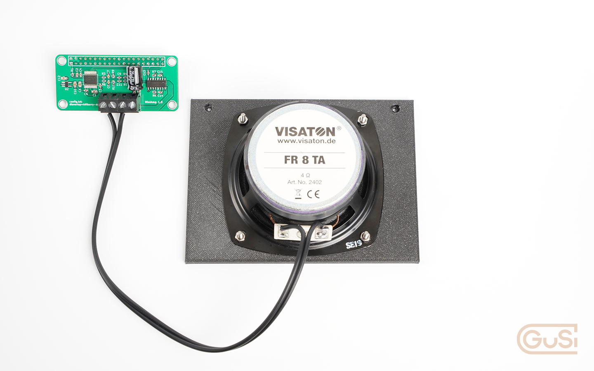
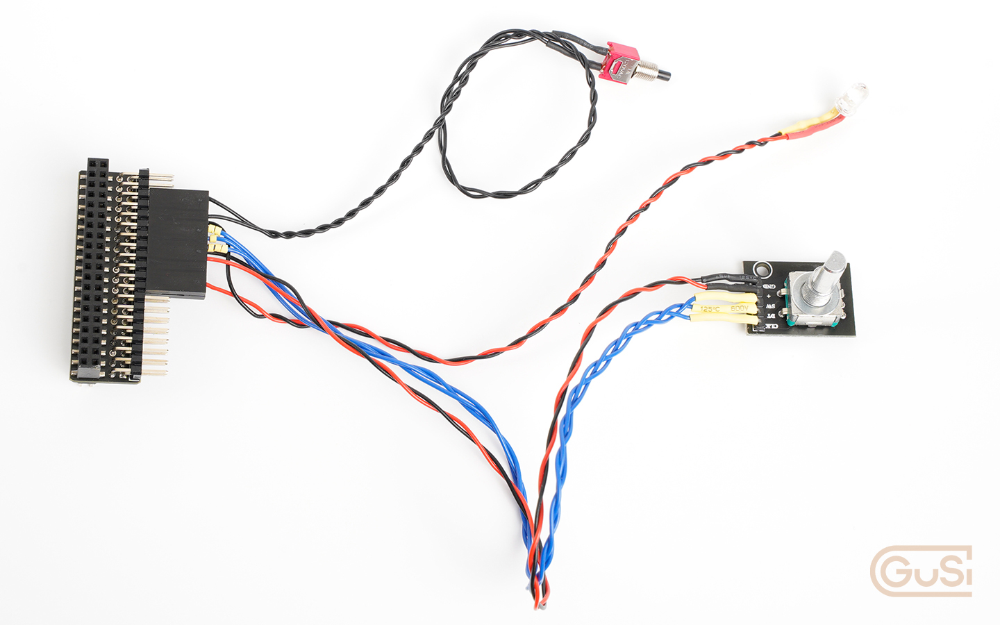
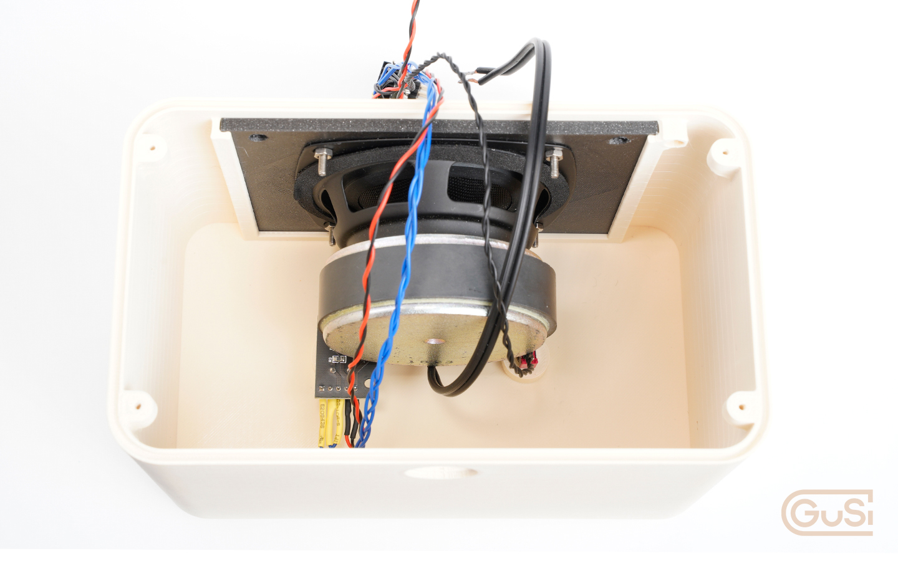
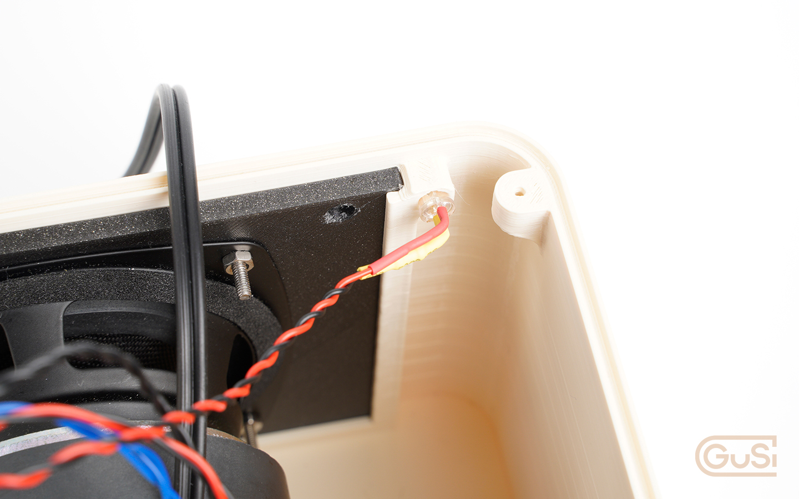
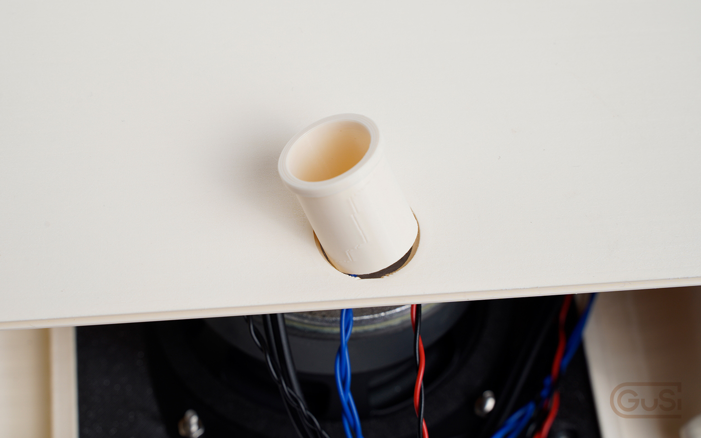
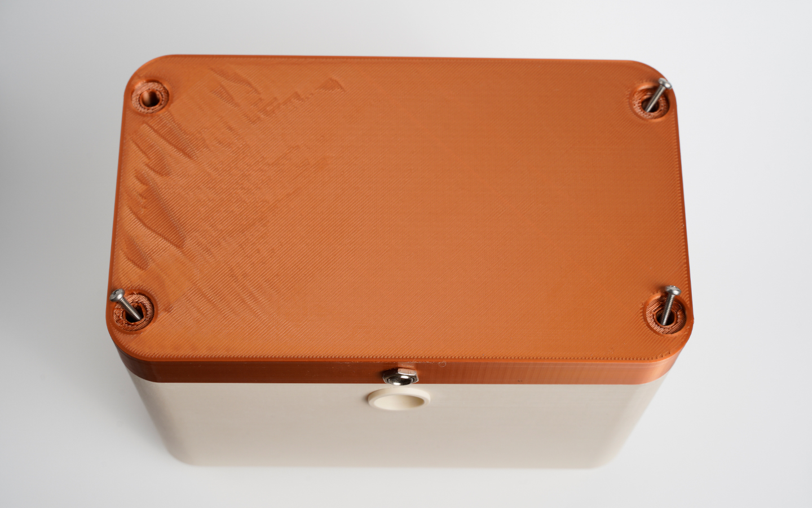

# gusi-radio

GuSi – the user friendly internet radio

The GuSi radio is a very user-friendly internet radio with only two buttons. It allows the user to switch through predefined stations with just one push on the button. This makes it especially suitable for seniors or handicapped people.

------------

### Components you need

 - 1 x Raspberry Pi zero
 - 1 x Power supply unit (5 V with a barrel jack 2.1 / 5.5 mm)
 - 1 x Hifiberry MiniAMP
 - 1 x Micro SD Card 
 - 1 x Small speaker with 10-30 W
 - 1 x LED 5 mm (~10000 mcd)
 - 1 x Pushbutton (ideally with a thread)
 - 1 x Power jack socket
 - 1 x Speaker cable (about 0.5 mm²)
 - 1 x Cable (about 0.14 mm²) for the connections
 - 1 x Short Micro-USB cable with open ends
 - 6 x Pan head screw M2.5 4 mm 
 - 6 x Pan head screw M2.5 10 mm 
 - 4 x Safety hexagon nut M2.5
 - 1 x GPIO edge adapter
 - Some Dupont crimps
 - 1 x Rotarry encoder KY-040
 - 1 x Resistor 10kΩ

80% of the components can be purchased from reichelt.de (Preconfigured shopping cart: [Gusi Radio](https://www.reichelt.de/my/1832192 "Gusi Radio")). The screws and the GPIO edge are not included.

The 3D data can be downloaded [here](https://www.thingiverse.com/thing:4823464 "Thingiverse").

------------

### Software installation

 **1) Install the OS**
 Install Raspberry Pi OS lite on the SD card. You can use the tool [Raspberry Pi imager](https://www.raspberrypi.org/software/ "Raspberry Pi imager") for this.

  **2) Prepare the SD-Card**
After the installation, open the SD card (should be labeled as "boot") and copy the files from the folder "sd-card" to the card.
- *ssh* (allows to connect via ssh)
- *wpa_supplicant.conf* (WiFi connection)


Open the *config.txt* with an editor. Add the following code at the bottom:
```
 ################## GUSI ################
# Disable Bluetooth`
dtoverlay=pi3-disable-bt
# Power On/Off Button
dtoverlay=gpio-shutdown,gpio_pin=3, active_low=1,gpio_pull=up
# Enable Hifiberry Soundcard
dtoverlay=hifiberry-dac
```

Open the *wpa_supplicant.conf*  and enter the WiFi access data there.

------------


  **3) SSH Connection**
Insert the card into the Raspberry and let it boot up. Find out which IP address your Pi got. Now access the Raspberry via SSH.

`ssh pi@192.168.1.100`

The default login data are "pi" and "raspberry"

------------


  **4) Raspberry Configuration**
Change device name:

`hostnamectl set-hostname 'GuSi'`

Change password:

`passwd`

Change time zone:

`sudo timedatectl set-timezone Europe/Berlin`

These settings can also be made via the Raspi-Config:

`sudo raspi-config`

> System Options > S4 Hostename > "GuSi" 
System Options > S3 Password > "XXXXX" 
Localisation Options > L2 Timezone > Europa > Berlin 
Localisation Options > L4 WLAN Country > DE Germany

------------

  **5) Set up Hifiberry**
Set Hifiberry as default audio device

`sudo nano /etc/asound.conf`

Insert following text:
```
    pcm.hifiberryMiniAmp {
        type softvol
        slave.pcm "plughw:0"
        control.name "Master"
        control.card 0
    }
    pcm.!default {
        type       plug
        slave.pcm  "hifiberryMiniAmp"
    }
```
For devices with an headphone jack:

`sudo nano /etc/modprobe.d/alsa-blacklist.conf`

Insert following text:
```
blacklist snd_bcm2835
```

------------


  **6) Install Music Player Deamon**
  
`sudo apt-get update`

`sudo apt-get upgrade`

`sudo apt-get install mpd mpc alsa-utils`

Improve stability:

`sudo nano /etc/modprobe.d/8192cu.conf`

Insert following text:
```
options 8192cu rtw_power_mgnt=0 rtw_enusbss=0

rtw_ips_mode=1

```

------------

  **6) Install GuSi**

Install git:

`sudo apt install git`

Clone the repository:

`git clone https://github.com/earlmckay/gusi-radio`

Replace the original MPC config:

`sudo mv /home/pi/gusi-radio/mpd.conf /etc/`

Reboot the device

`sudo reboot`

Update the Music player database

`sudo mpc update`

------------


  **7) Set up autostart**

`crontab -e`

Insert following text at the bottom:
```
@reboot /home/pi/gusi-radio/autostart.sh
```

Make the script executable:

`sudo chmod a+x /home/pi/gusi-radio/autostart.sh`

------------


  **8) Install Python 2.7 librarys**

`sudo apt-get install python-pip`

`sudo pip install gpiozero`

Customize the channel list according to your needs. For this you only need to change the URLs in the variables.

Test if the python script runs without errors.

`python /home/pi/gusi-radio/gusi.py`

------------


  **8) Optimization**
Deaktivate swapping:

`sudo systemctl stop dphys-swapfile`

`sudo systemctl disable dphys-swapfile`

Deactivate some unused modules:

`sudo systemctl disable keyboard-setup.service`

`sudo systemctl disable triggerhappy.service`

`sudo /usr/bin/tvservice -o`

Reboot the device

`sudo reboot`

------------

## Hardware installation

Solder the micro USB cable to the power socket and screw it into the case. Also the raspberry. 


Screw the speaker to the mount, solder the cables to it and connect it to the amplifier.


Solder cables to the push button, rotary encoder and the LED. Between LED and cable is the resistor.


Screw the rotary encoder and the pushbutton into the housing. Slide the speaker holder into the slot.


Insert the LED into the hole. You can fix this with hot glue.


Connect the cable ends to the Raspberry. 
| Pin | Physical | BCM |
| :------------ | :------------: | :------------: |
| Rotary CLK | 11 | 17 |
| Rotary DT | 13 | 27 |
| Rotary SW | 15 | 22 |
| Rotary 3V | 17 |
| Rotary GND | 14 |
| Power | 5 | 3 |
| Power | 9 |
| LED + | 8 | 14 |
| LED GND | 20 |


Insert the bass reflex tube into the hole on the the back.


Close the housing and screw it with 4 screws.


------------
Finally, I would like to thank [Robert Nickel](https://github.com/Robert-Nickel) for his support, as well to [Notification Sounds](https://notificationsounds.com/) for providing the sounds.
