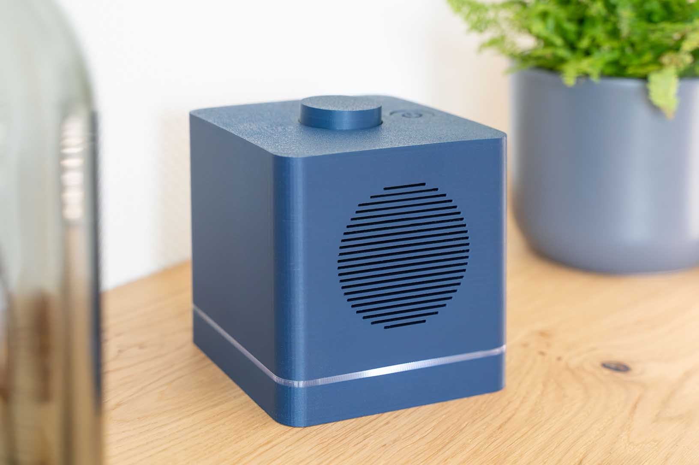
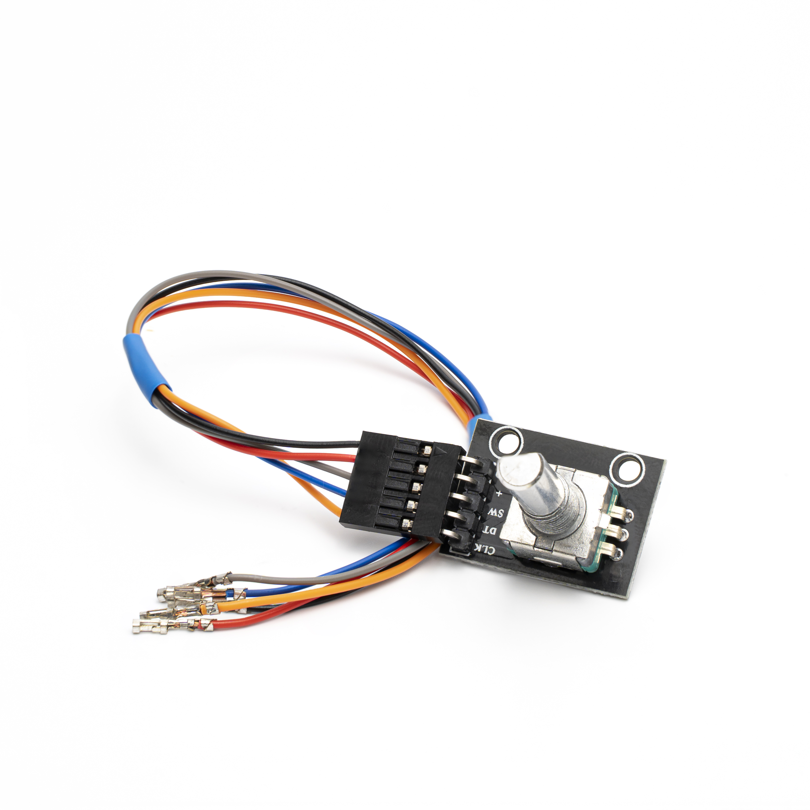
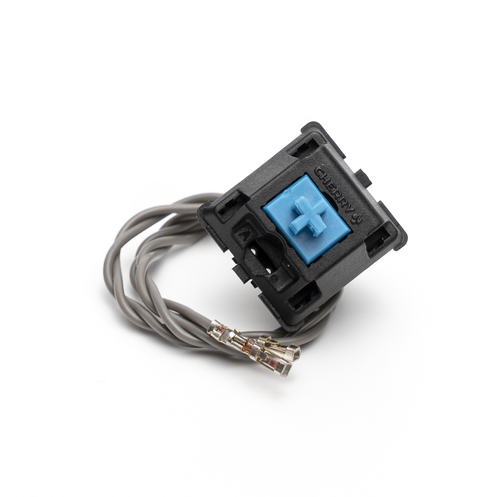
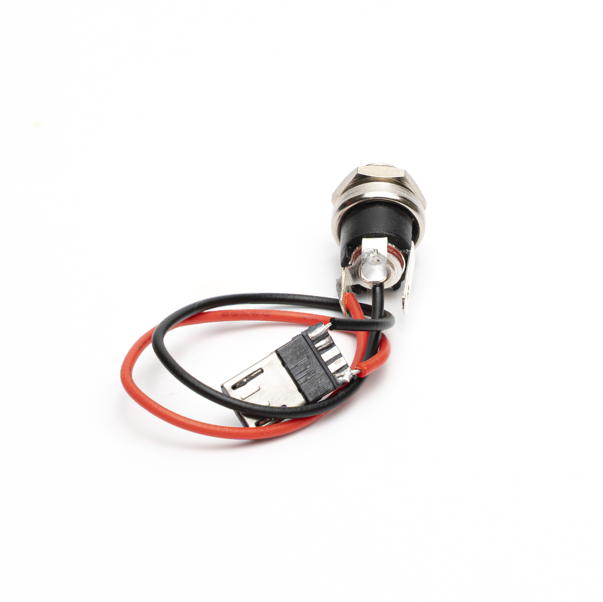
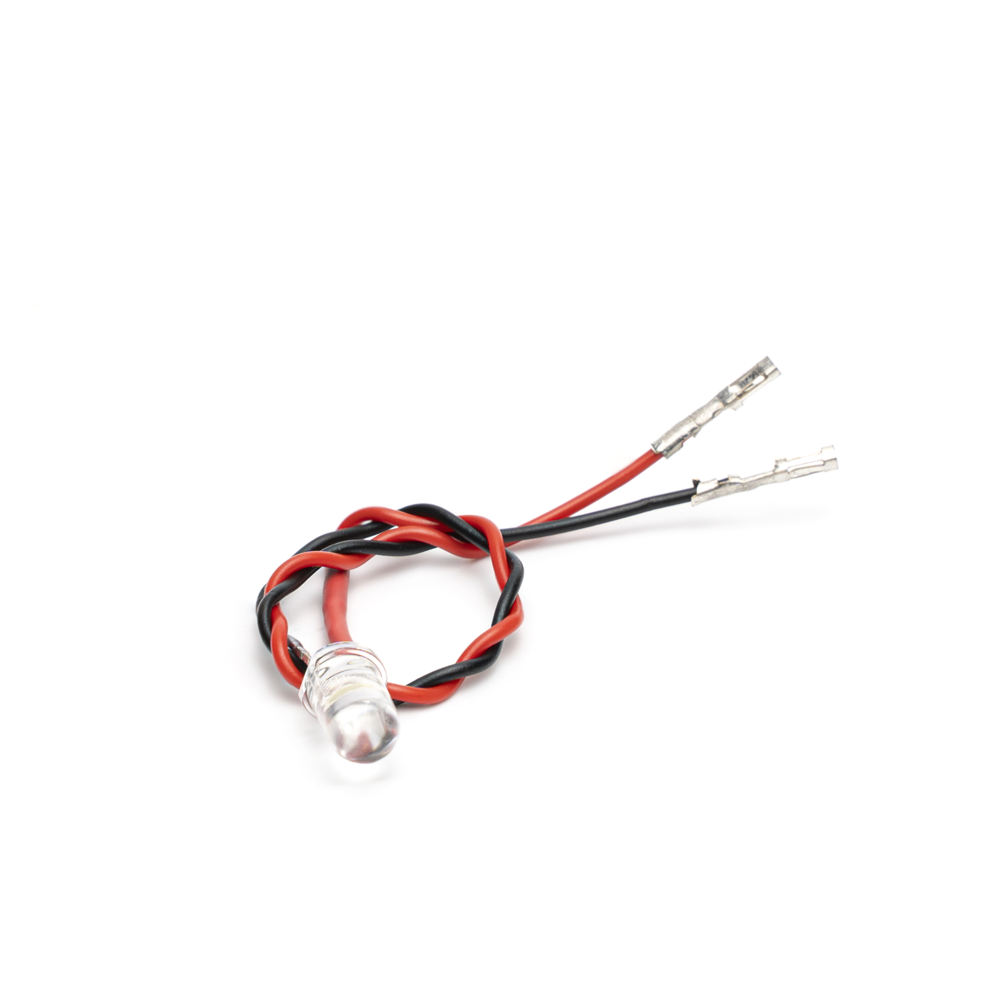
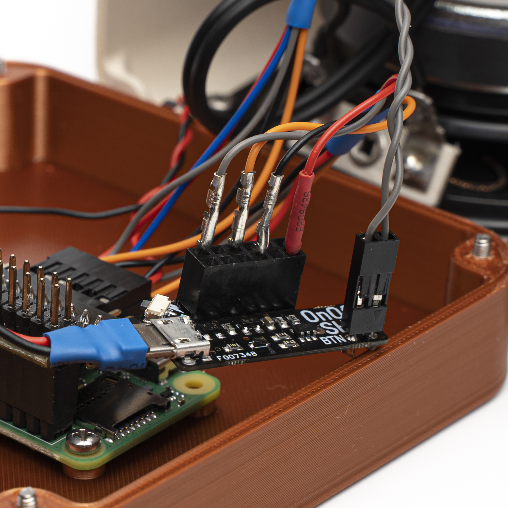
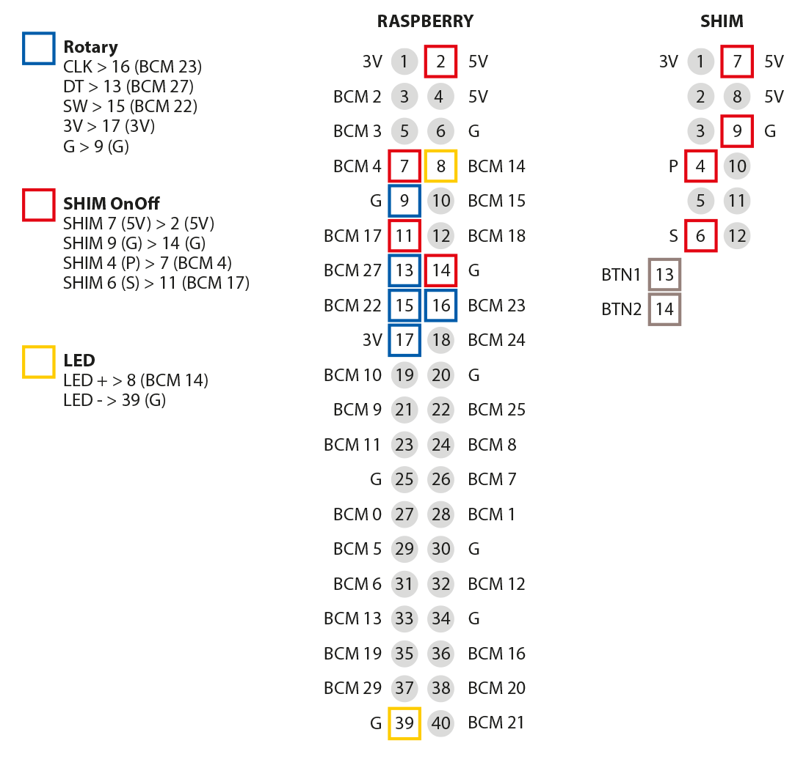
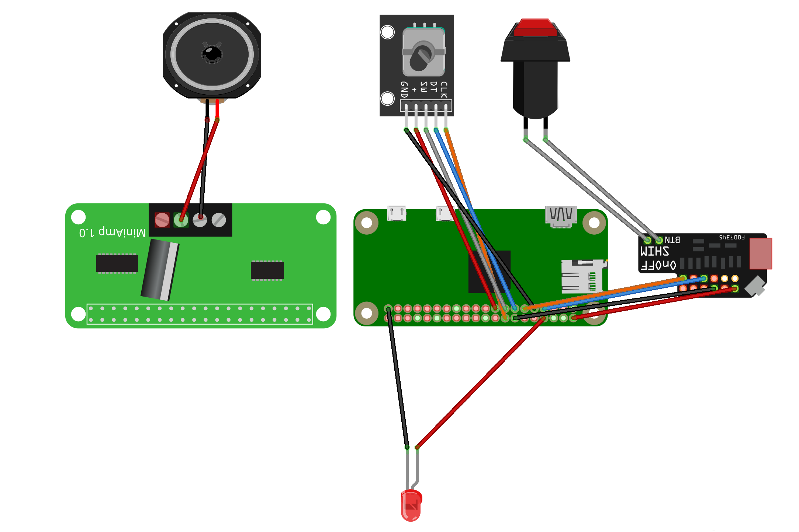

# GuSi-radio

GuSi – the user friendly internet radio

The GuSi radio is a very user-friendly internet radio with only two buttons. It allows the user to switch through predefined stations with just one push on the button. This makes it especially suitable for seniors or handicapped people.

A short demonstration of the radio can be found [here](https://youtu.be/FBuoywtGWyI).

------------

### Instructions for WLAN registration using the SD card / Anleitung zur WLAN-Anmeldung mithilfe der SD-Karte

Open the housing and insert the SD card into a computer. Open the text editor and insert the following lines:

```
country=EN
ctrl_interface=DIR=/var/run/wpa_supplicant GROUP=netdev
update_config=1
network={
ssid="NAME"
psk="PASSWORD"
}
```

Replace NAME and PASSWORD inside the quotes with the WLAN credentials.
Save the document as: wpa_supplicant.conf
Attention it should not have the extension ".txt".
Paste the file onto the SD card, put it back into the radio and start it.

Gehäuse öffnen und die SD-Karte in einen Computer stecken. Öffnen sie den Text-Editor und fügen Sie folgende Zeilen ein:

```
country=DE
ctrl_interface=DIR=/var/run/wpa_supplicant GROUP=netdev
update_config=1
network={
ssid="NAME"
psk="KENNWORT"
}
```

NAME und KENNWORT innerhalb der Anführungszeichen durch die WLAN Anmeldedaten ersetzen.
Dokument als Datei speichern als: wpa_supplicant.conf
Achtung es darf nicht die Endung ".txt" haben.
Datei auf die SD-Karte einfügen, zurück ins Radio setzen und starten.

------------

### Components you need


 - 1 x [Raspberry Pi zero](https://www.reichelt.de/de/de/raspberry-pi-zero-wh-v-1-1-1-ghz-512-mb-ram-wlan-bt-rasp-pi-zero-wh-p222531.html?&nbc=1)
 - 1 x [Power supply unit (5 V with a barrel jack 2.1 / 5.5 mm)](https://www.reichelt.de/de/de/steckernetzteil-12-w-5-v-2-4-a-ea1012ahes501-p293278.html?&nbc=1)
 - 1 x [Hifiberry MiniAMP](https://www.reichelt.de/de/de/raspberry-pi-shield-hifiberry-miniamp-rpi-hb-mini-amp-p191036.html?&nbc=1)
 - 1 x [Micro SD Card](https://www.reichelt.de/de/de/microsdhc-speicherkarte-16gb-sandisk-ultra-sdsquar016ggn6ma-p214843.html?&nbc=1)
 - 1 x [Small speaker with 10-30 W](https://www.reichelt.de/de/de/breitbandlautsprecher-fr-8-ta-10-w-4-ohm-vis-2402-p239748.html?&nbc=1)
 - 1 x [LED 5 mm](https://www.reichelt.de/de/de/led-5-mm-bedrahtet-kaltweiss-7150-mcd-50--led-el-5-7150kw-p164206.html?&nbc=1)
 - 1 x [Pushbuton (Cherry MX Key)](https://www.reichelt.de/de/de/cherry-mx-blue-keyswitch-cherry-mx1a-e1nn-p202569.html?&nbc=1)
 - 1 x [Power jack socket](https://www.reichelt.de/de/de/einbaubuchse-zentraleinbau-aussen-5-6-mm-innen-2-1-mm-hebl-21-p8524.html?&nbc=1)
 - 1 x [Speaker cable (about 0.5 mm²)](https://www.reichelt.de/de/de/zwillingslitze-flexibel-2x0-5mm-5m-ring-la-205-5-p9816.html?&nbc=1)
 - 1 x [Cable (about 0.14 mm²) for the connections](https://www.reichelt.de/de/de/kupferlitze-isoliert-10-m-1-x-0-14-mm-schwarz-litze-sw-p10298.html?&nbc=1)
 - 1 x [Micro-USB plug](https://www.reichelt.de/de/de/micro-usb-stecker-typ-b-5-polig-usb-micro-st-p124013.html?&nbc=1)
 - 6 x [Pan head screw M2.5 6 mm](https://www.ebay.de/itm/251411230965?_trkparms=ispr%3D1&hash=item3a8946f0f5:g:FYEAAOxydlFSrMWA&amdata=enc%3AAQAGAAACoPYe5NmHp%252B2JMhMi7yxGiTJkPrKr5t53CooMSQt2orsSg3Ye8yTWgOW7pmE1t838dpsBclJk1M3ulJ%252FglBcTmXJX3%252BzRg0H2INadil%252BBp%252Fk%252BZY%252FI%252BR%252F5uJ0EoVAWur4JjuGs48Sg2KLeW%252BfF%252BaRPvEHQ%252BzfUq68tp6TKcf7bCp9xiAAHtK88EaOCE1ueldkUDYmH4i8crB%252FNoDd%252FMtRoHkRWLuQ9FRKNjTqua7zyMzCPcVT3KLCta8zEheq0RPYYOmW1KYRUcVc8eYGLXTMeVa34MfFfNdfN%252BJLqZ%252FhhrtV9OKFQBVq9rM%252BdgimLALmkp2xAwklhRJH1H56gfWjoghc5vMG%252BWp2FME5AeQVpADuWC4NRhHTI8E2GP2UI3426VWVQ9uDTMaJUJ6CMK%252Bgg2IAHQ8dNrA3CwlagbuB%252BGRI3r7vCTXbZx5zsRvjkw01GdeczQCdYotA4mJT6m3T9hXuC446gixqgCcNtCJgFHcsCZC2ai7Qfpq%252BmDMa1qJIU%252B4uXGY%252FV2qJ%252FNIkIldPFcwT7xgwRo0S9J72iEKf5tXg1HrZDxsTRWiYRuVDTdrnJP%252BudIqH%252BWO8YY15q4CSu8%252B72q5oVHwHFwDZGGdsRnCwRx3Zav9bpc9RcGap60Pxd8%252Bp4ZQC9uirkEFsw4lBKgdRFdYhK9MwP6aXsDw4SPjIIDSq%252F5uiRel%252BMiOHdVQwlR4L35UQMTlZDyR2QpdY%252FwbGfzO%252B%252BBo3RtbwAMmGnVGD3nx9aTrr2uwRYrrmjgXakt5l6IL3xSxt5IvMYZE%252BO6gBad9VLLtI4np1qGjoLGWHx35NqyfM45ATQvCoV6Yu4xOaQVz%252FNVph4NcoSQ1RVz%252Fm4TdMZrDx%252FscbNagSiyy1JZUXA6Z0GmcfdOqJ1ItIFsQ%253D%253D%7Cclp%3A2334524%7Ctkp%3ABFBMyJyE5c1f)
 - 6 x [Pan head screw M2.5 10 mm](https://www.ebay.de/itm/251411230965?_trkparms=ispr%3D1&hash=item3a8946f0f5:g:FYEAAOxydlFSrMWA&amdata=enc%3AAQAGAAACoPYe5NmHp%252B2JMhMi7yxGiTJkPrKr5t53CooMSQt2orsSg3Ye8yTWgOW7pmE1t838dpsBclJk1M3ulJ%252FglBcTmXJX3%252BzRg0H2INadil%252BBp%252Fk%252BZY%252FI%252BR%252F5uJ0EoVAWur4JjuGs48Sg2KLeW%252BfF%252BaRPvEHQ%252BzfUq68tp6TKcf7bCp9xiAAHtK88EaOCE1ueldkUDYmH4i8crB%252FNoDd%252FMtRoHkRWLuQ9FRKNjTqua7zyMzCPcVT3KLCta8zEheq0RPYYOmW1KYRUcVc8eYGLXTMeVa34MfFfNdfN%252BJLqZ%252FhhrtV9OKFQBVq9rM%252BdgimLALmkp2xAwklhRJH1H56gfWjoghc5vMG%252BWp2FME5AeQVpADuWC4NRhHTI8E2GP2UI3426VWVQ9uDTMaJUJ6CMK%252Bgg2IAHQ8dNrA3CwlagbuB%252BGRI3r7vCTXbZx5zsRvjkw01GdeczQCdYotA4mJT6m3T9hXuC446gixqgCcNtCJgFHcsCZC2ai7Qfpq%252BmDMa1qJIU%252B4uXGY%252FV2qJ%252FNIkIldPFcwT7xgwRo0S9J72iEKf5tXg1HrZDxsTRWiYRuVDTdrnJP%252BudIqH%252BWO8YY15q4CSu8%252B72q5oVHwHFwDZGGdsRnCwRx3Zav9bpc9RcGap60Pxd8%252Bp4ZQC9uirkEFsw4lBKgdRFdYhK9MwP6aXsDw4SPjIIDSq%252F5uiRel%252BMiOHdVQwlR4L35UQMTlZDyR2QpdY%252FwbGfzO%252B%252BBo3RtbwAMmGnVGD3nx9aTrr2uwRYrrmjgXakt5l6IL3xSxt5IvMYZE%252BO6gBad9VLLtI4np1qGjoLGWHx35NqyfM45ATQvCoV6Yu4xOaQVz%252FNVph4NcoSQ1RVz%252Fm4TdMZrDx%252FscbNagSiyy1JZUXA6Z0GmcfdOqJ1ItIFsQ%253D%253D%7Cclp%3A2334524%7Ctkp%3ABFBMyJyE5c1f)
 - 1 x [GPIO edge adapter](https://www.berrybase.de/neu/gpio-edge-erweiterung-gpio-adapter-f-252-r-raspberry-pi?c=2413)
 - [Dupont crimps](https://www.reichelt.de/de/de/entwicklerboards-dupont-crimp-set-610-teilig-debo-set-dupont-p279901.html?&nbc=1)
 - 1 x [Rotarry encoder KY-040](https://www.berrybase.de/bauelemente/passive-bauelemente/potentiometer/drehimpulsgeber/drehregler/rotary-encoder-mit-breakoutboard)
 - 1 x [SHIM OnOff](https://www.reichelt.de/de/de/raspberry-pi-shield-onoff-shim-rpi-shd-onoff-p272023.html?&nbc=1)

80% of the components can be purchased from reichelt.de (Preconfigured shopping cart: [Gusi Radio](https://www.reichelt.de/my/1832192 "Gusi Radio")). The screws, the GPIO edge and the Rotary Encoder are not available there.

The 3D files can be downloaded at 
[printables.com](https://www.printables.com/de/model/459099-gusi-radio)
or [thingiverse.com](https://www.thingiverse.com/thing:5206074 "Thingiverse").


------------

### Software installation

 **1) Install the OS**
 Install Raspberry Pi OS lite on the SD card. You can use the tool [Raspberry Pi imager](https://www.raspberrypi.org/software/ "Raspberry Pi imager") for this.

Operating system: 
- Raspberry Pi OS Lite (32-Bit)

Settings (Gear icon)
- Hostname: GuSi
- activate SSH: use password
- user and password: "gusi" and a good a strong password 
- Set up WIFI: Enter the WLAN login data here
- Select your WiFi and Time Location an Keyboard language

Click on "save" and then on "write" to start the installation.

------------

  **2) SSH Connection**
Insert the card into the Raspberry and let it boot up. Find out which IP address your Pi got. You can try ```ping gusi```.

Now access the Raspberry via SSH.
```ssh gusi@192.168.1.100``` 

------------

  **3) Install 

Fetch latest version of packages:
  ```sudo apt-get update -y```

Download and install updates for outdated packages:
```sudo apt-get upgrade -y```

Install Music Player Daemon with ALSA:
```sudo apt-get install mpd mpc alsa-utils```

Install Git:
```sudo apt install git```

Install Python 3:
```sudo apt-get install python3-pip```

Install GPIOzero Library:
```sudo apt install python3-gpiozero```

------------

  **4) Clone repository and place files:

Clone the Git-files to Raspberry:
```git clone https://github.com/earlmckay/gusi-radio.git```

Move the rc.local to start the start.py automatically on boot:
```sudo mv /home/gusi/gusi-radio/rc.local /etc/```

Make the rc.local executable:
```sudo chmod a+x /etc/rc.local```

Move cleanshutd.conf to the directory:
```sudo mv /home/gusi/gusi-radio/cleanshutd.conf /etc/```

Create a new file and open it in the editor:
```sudo nano /etc/modprobe.d/8192cu.conf```

Insert following text:
```
options 8192cu rtw_power_mgnt=0 rtw_enusbss=0

rtw_ips_mode=1
```
Open the boot.conf in the editor
```sudo nano /boot/firmware/config.txt```


Add the following lines at the bottom.

``` 
################## GUSI ################
# Disable Bluetooth
dtoverlay=pi3-disable-bt

# Enable Hifiberry Soundcard
dtoverlay=hifiberry-dac
```

Open the asound.conf in the editor
```sudo nano /etc/asound.conf```

Insert following text:
```
pcm.hifiberryMiniAmp {
    type softvol
    slave.pcm "plughw:0"
    control.name "Master"
    control.card 0
}
pcm.!default {
    type       plug
    slave.pcm  "hifiberryMiniAmp"
}
```

------------

  **5) Optimization

Deaktivate swapping:

```sudo systemctl stop dphys-swapfile```

```sudo systemctl disable dphys-swapfile```


Deactivate some unused modules:

```sudo systemctl disable keyboard-setup.service```

```sudo systemctl disable triggerhappy.service```

```sudo /usr/bin/tvservice -o```

------------

  **6) Custom settings**
For English:
```sudo mv /home/gusi/gusi-radio/EN/mpd.conf /etc/```

```rm -r /home/gusi/gusi-radio/DE```

```sudo systemctl start mpd```

```sudo systemctl enable mpd```

```mpc update```


For German:
```sudo mv /home/gusi/gusi-radio/DE/mpd.conf /etc/```

```rm -r /home/gusi/gusi-radio/EN```

```mpc update```

(Moves the configuration file for the music player, which has the correct paths to the audio data, to the correct location and deletes the unneeded voice data.)

------------

  ***GUSI.py***

Open the gusy.py in the editor:
```sudo nano /home/gusi/gusi-radio/gusi.py```

Customize radio station:

First, the URLs in the variables must be customized to your preferences. 
To do this, change the URLs for "RS1", "RS2" and "RS3" in the "VAR DEFINITIONS" area.

If more stations are needed, the list of variables can be extended with "RS4", "RS5" ... .
Also remember to adjust the amount in the areas "RADIO STATION ORDER" and "ANNOUNCEMENTS ORDER". (Here simply continue the list).

------------

  ***AUTO-WPS.py***

```nano /home/gusi/gusi-radio/auto_wps.py```

Search for (Linie 35):
```
print("reset wpa_supplicant.conf")
new_config = """ctrl_interface=DIR=/var/run/wpa_supplicant GROUP=netdev
update_config=1
country=DE
"""
```

Replace DE with the required country code

------------

  **8) Install SHIM OnOFF**
Install the ON/OFF switch with the manufacturer's code:
```curl https://get.pimoroni.com/onoffshim | bash```

or:

Alternatively, move this data to the locations:
```chmod a+x home/gusi/gusi-radio/onoffshim.sh```
```bash /home/gusi/gusi-radio/onoffshim.sh```

------------

## Hardware installation

  **01) Prepare Cable**
Following cable lengths are required:
- Loudspeaker: 2 x 120 mm
- Rotary encoder: 5 x 200 mm
- Pushbutton: 2 x 200 mm
- OnOff SHIM: 2 x 100 mm
- LED: 2 x 160 mm

Insulate both ends by approx. 3 mm.

------------

  **02) rotary encoder**
The Rotary Encoder has a total of 5 pins:
- GRD: Ground
- +: voltage
- SW: Push
- CLK: Primary rotation
- DT: Phase shifted rotation 

Crimp the 5 prepared cables with a female Dupon connector on each side and connect the cables to the Rotary Encoder.



------------


  **03) prepare the pushbutton**

For the pushbutton, one part of the cables must be soldered to the button, the other ends get a female Dupon connector.
Crimp the 5 prepared cables with a female Dupon connector on each side and connect the cables to the Rotary Encoder.



------------

  **04) insert the rotary control and the button**

Now you can screw the rotary encoder into the middle hole of the case. Make sure that it sits straight, otherwise the knob will wobble.
The push button is inserted into the outside of the case. It should snap into place. 


------------

  **05) power supply**

Before you insert the power socket, solder the cables first. This is more comfortable and avoids damaging the plastic housing. 
Seen from the back, the positive pole is on the left and the negative pole on top.

Now you can solder the cables to the micro USB connector. 
The left contact is the positive pole, the one on the right side is the negative pole (see picture).




------------

  **06) loudspeaker**

First the easy part. Solder two cables to the two speaker contacts. 
The other ends of the cables do not need to be worked on, as they will be clamped into the amplifier later. 

Before you screw in the speaker, the speaker grille must be inserted first. Make sure that the holes are exactly aligned with those in the housing.
Now place the speaker in the cabinet on the grille and fix it with the 6 mm screws.


------------

  **07) LED**

For the LED you need the two prepared cables and two female Dupon connectors, which are crimped on one side of the cable. 
The other sides have to be soldered to the LED itself. I used here for the anode (longer pin of the LED) the red cable and for the shorter side (cathode) the black cable. To avoid a short circuit, a heat shrink tube can be used.
Now push the LED into the holder.



------------

  **08) SHIM OnOff**


The board comes with optional female connectors, which I also used. For the two button contacts I cut and soldered two male Dupon connectors.
The pre-assembled cables can now be equipped with a male Dupon connector on one end and a female connector on the other end. 



------------

  **09) Connection**

First, the Raspberry can be screwed to the lower base plate.
Then the GPIO corner adapter can be plugged on, followed by the MiniAmp.

Then everything can be connected one by one.

1) Rotary Encoder to Raspberry
2) SHIM OnOff with Raspberry
3) Pushbutton with SHIM OnOff
4) LED with Raspberry
5) Power supply with SHIM On Off
6) Speaker with MiniAmp





------------
Finally, I would like to thank [Robert Nickel](https://github.com/Robert-Nickel) for his support, as well to [Notification Sounds](https://notificationsounds.com/) for providing the sounds.
